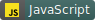

.gif)

## 🌱  **About Me** 
- Pronouns: She/Her
- I'm currently working on developing a sudoku game in React-Native and TypeScript
- I'm always looking to learn new things, but work primarily in Front-end and Full-Stack development.
- Fun Fact: I love to paint, and I like to bring that style into my designs and colour schemes

## 🔧  **Technologies & Tools**
 
  
   
 
  

## ✉️  **Reach Me**
 
 

## 😂  **Coding Jokes**
>Where is a programmers favourite place to hangout? ***Foo Bar***

 

>Why did the programmer quite his job? ***Because he didn't get arrays***